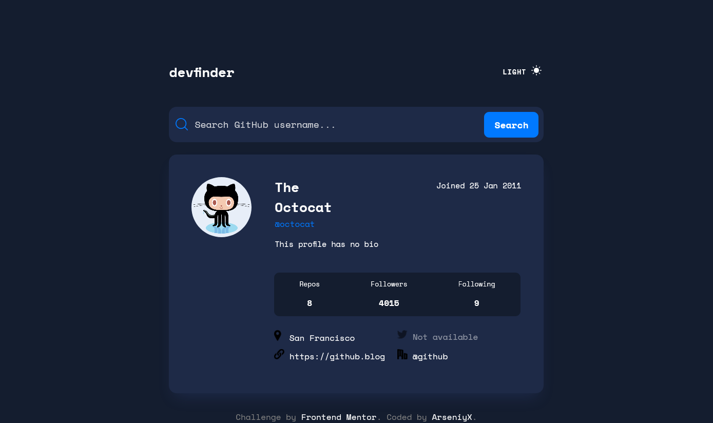
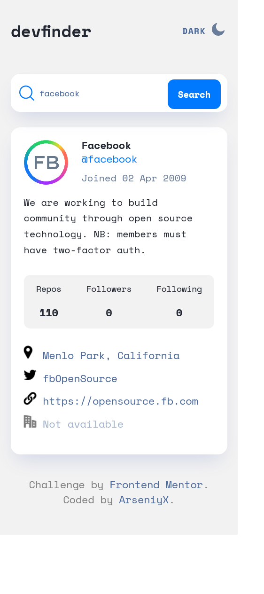

# Frontend Mentor - GitHub user search app solution

This is a solution to the [GitHub user search app challenge on Frontend Mentor](https://www.frontendmentor.io/challenges/github-user-search-app-Q09YOgaH6). Frontend Mentor challenges help you improve your coding skills by building realistic projects. 

## Table of contents

- [Overview](#overview)
  - [The challenge](#the-challenge)
  - [Screenshot](#screenshot)
  - [Links](#links)
- [My process](#my-process)
  - [Built with](#built-with)
  - [What I learned](#what-i-learned)
  - [Continued development](#continued-development)
  - [Useful resources](#useful-resources)
- [Author](#author)

## Overview

### The challenge

Users should be able to:

- View the optimal layout for the app depending on their device's screen size
- See hover states for all interactive elements on the page
- Search for GitHub users by their username
- See relevant user information based on their search
- Switch between light and dark themes
- **Bonus**: Have the correct color scheme chosen for them based on their computer preferences. _Hint_: Research `prefers-color-scheme` in CSS.

### Screenshot

### Links

- [Solution URL](https://github.com/ArseniyX/github-user-search)
- [Live site URL](https://arseniyx.github.io/github-user-search/)

## My process

### Built with

- Semantic HTML5 markup
- CSS custom properties
- Flexbox
- CSS Grid
- Mobile-first workflow
- [React](https://reactjs.org/) - JS library
- [Styled Components](https://styled-components.com/) - For styles

### What I learned

- How to make responsive web design.
- How to get data from API
- How to deal with svg images
- How to use styled-components
- How to provide themes

### Continued development

I want to create more web sites for practice more: writing code faster for improve my web dev skills

### Useful resources

- [Dev.to](https://dev.to/yuribenjamin/how-to-deploy-react-app-in-github-pages-2a1f) - This helped me to publish my react project to the github pages
- [Stackoverflow](https://stackoverflow.com/questions/63031976/react-js-how-to-disable-zoom) - Its help me to disable scale for users of mobile devices

## Author

- Website - [Arseniy](https://www.arseniyx.com)
- Frontend Mentor - [@AseniyX](https://www.frontendmentor.io/profile/arseniyx)
- GitHub - [@ArseniyX](https://github.com/arseniyx)

